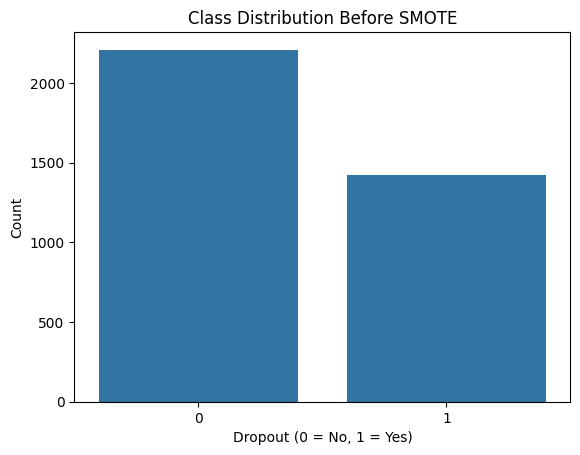
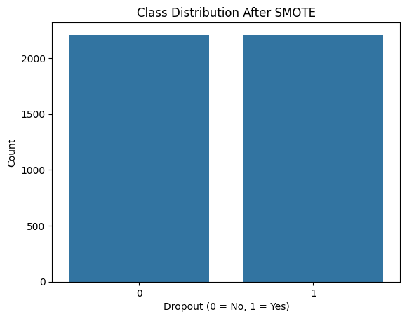
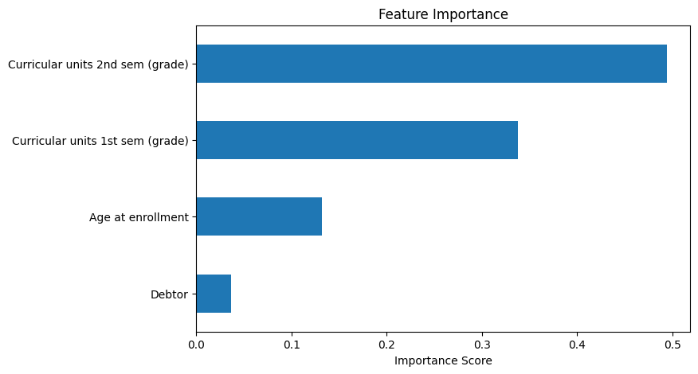
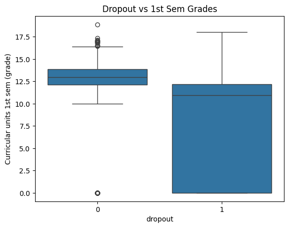

# 🎓 Student Dropout Prediction

## 📌 Overview
This project is a **Machine Learning-based system** that predicts whether a student is likely to drop out based on academic performance and personal attributes.

It helps institutions identify at-risk students early and take preventive actions to improve student retention.

---

## 🎯 Problem Statement
Student dropout is a major issue in education systems. Identifying students at risk in advance can help:

- Improve academic success  
- Provide timely support  
- Reduce dropout rates  

This project builds a predictive model to solve this problem.

---

## 🧠 Approach
- Data preprocessing  
- Feature selection  
- Handling imbalanced data using **SMOTE**  
- Model training using **Random Forest Classifier**  
- Model evaluation  
- Prediction using custom input  

---

## 📊 Features Used
- Curricular units 1st semester (grade)  
- Curricular units 2nd semester (grade)  
- Age at enrollment  
- Debtor status  

---

## 🌳 Model Used
**Random Forest Classifier**

---

## 📈 Output
- Dropout (**Yes / No**)  
- Probability of dropout (%)  
- Risk level (**Low / Medium / High**)  

---

## 📂 Project Structure

student_dropout/
│── README.md
│── data.csv
│── dropout.ipynb
│── requirements.txt
│── images/


---

## ⚖️ Handling Imbalanced Data

### 🔹 Before SMOTE


### 🔹 After SMOTE


📌 **Insight:**  
Dataset was imbalanced initially. SMOTE balanced both classes, improving model performance.

---

## 📊 Model Performance

- Accuracy: **85%**  
- Precision (Dropout): **0.85**  
- Recall (Dropout): **0.84**  
- F1-score: **0.84**  

### 🔢 Confusion Matrix

[[404 60]
[ 69 351]]


### 🔍 Insights
- Model performs well with balanced performance  
- Improved recall reduces missed dropout cases  
- Suitable for real-world early intervention systems  

---

## 📊 Visualizations

### 🔹 Feature Importance


📌 Insight:
- 2nd semester grades have highest impact  
- Academic performance is key factor  

---

### 🔹 Dropout vs Grades


📌 Insight:
- Lower grades are strongly associated with dropout  

---

## ⚙️ Installation & Setup

### 1️⃣ Clone the repository
```bash
git clone https://github.com/swaran05/student_dropout.git
cd student_dropout
2️⃣ Install dependencies
pip install -r requirements.txt
3️⃣ Run the notebook
jupyter notebook
▶️ Usage
Open dropout.ipynb
Run all cells
Modify input values
📌 Example Input
[12, 14, 20, 0]
🚀 Future Improvements
Add more features
Try XGBoost / LightGBM
Build Streamlit app
Deploy online
👨‍💻 Author

Swaran Chandra
